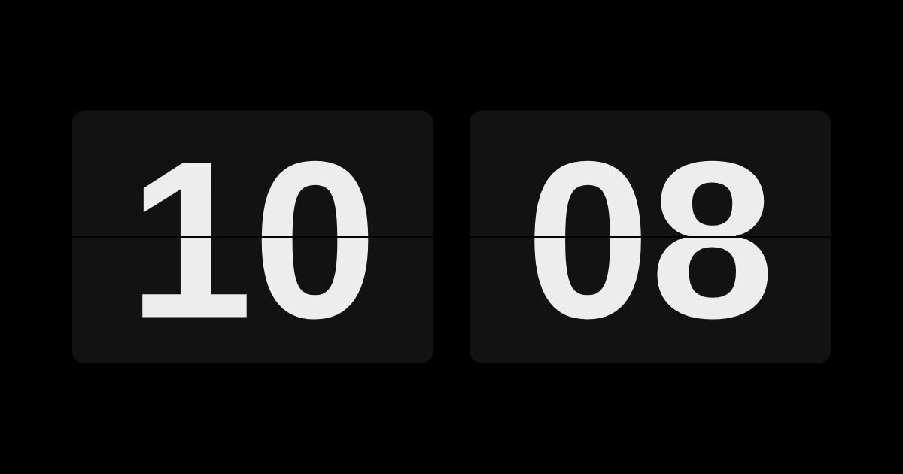
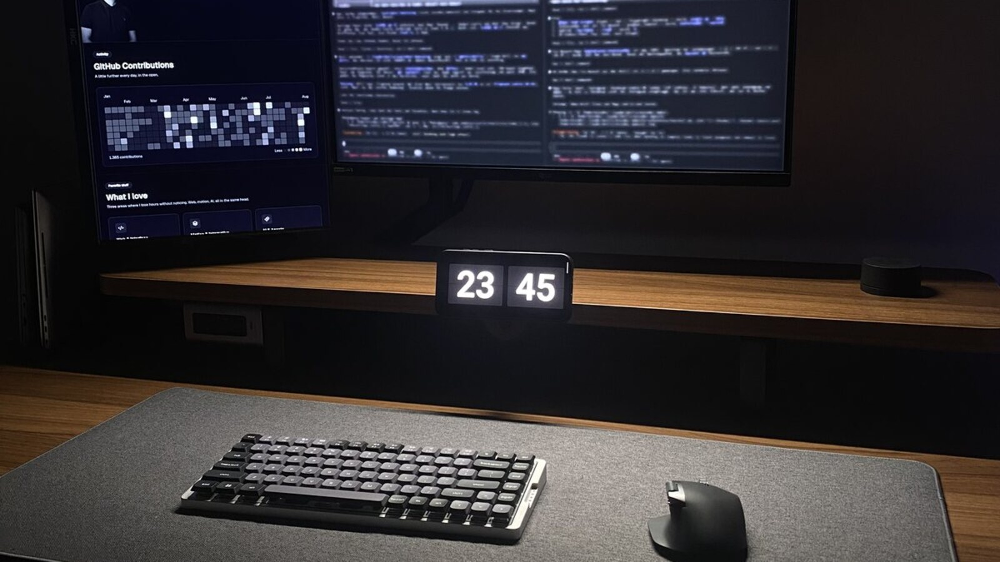
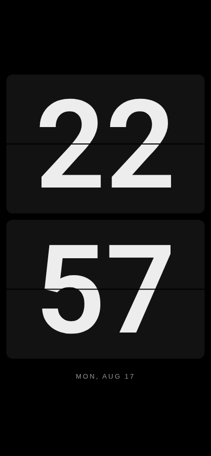
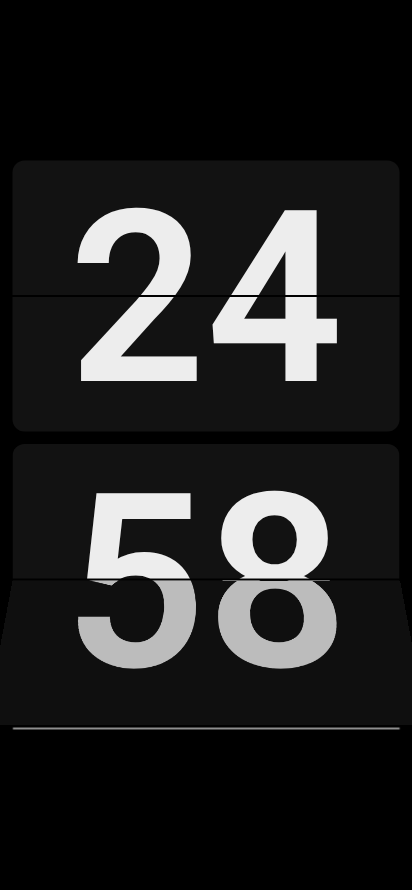
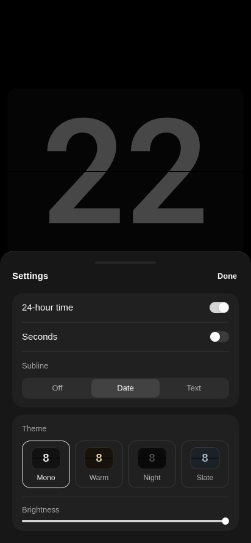
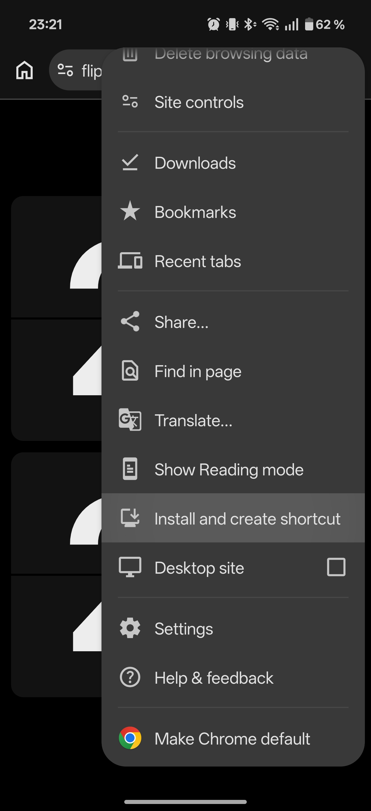
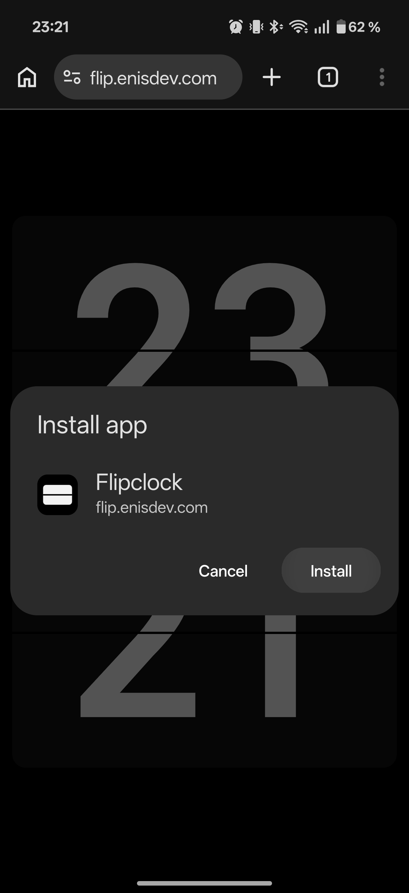
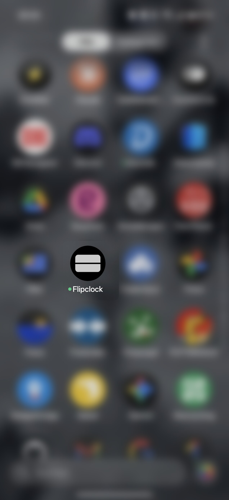

# Flipclock

A flip clock for the phone lying on your desk anyway, looked at and never operated.


[](https://flip.enisdev.com)

[Live](https://flip.enisdev.com) · [Android setup](docs/android-setup.md) · [Architecture](docs/architecture.md)

The screen shows the clock on black, nothing else. Swipe sideways and it becomes a focus timer, counting down in the same big digits. A tap toggles fullscreen on the clock and starts or pauses the timer. Swipe up or hold for 600 ms to open the settings, which close themselves again.

Five settings for the clock, one for the timer. All of it in `localStorage`, nowhere else.

After the first load the app needs no network. A service worker caches everything, so it works in airplane mode. No backend, no tracking, no CDN, every asset ships from the repo.

A phone in a mount, the cable in, the screen never off. That is the whole setup.



## Features

| Clock | Focus | Settings |
| --- | --- | --- |
|  |  |  |

- Mechanical flip on every change, true black behind it, four curated themes.
- Focus timer in the same digits: tap starts and pauses, presets from 15 to 90 minutes, a hairline carries the remaining time, the phone buzzes at zero.
- A subline under the clock: the date, or a line of your own.
- Settings in a drawer that drags, snaps and leaves on its own.
- OLED care built in: pixel shift, brightness dim, everything black stays truly off.
- Digits as a 1.5 KB Roboto subset with equal widths, so nothing shifts as the numbers change.

## Setting up the phone

Open [flip.enisdev.com](https://flip.enisdev.com) in Chrome, then install it from the menu and launch it from the icon, always:

| Menu · Install and create shortcut | Install | Launch from the icon |
| --- | --- | --- |
|  |  |  |

The app holds a screen wake lock, so the display stays on by itself. In short: install it as a PWA, adaptive brightness off and fixed low, cable for the battery. The full walkthrough, including OLED and heat notes: [docs/android-setup.md](docs/android-setup.md).

## Development

```bash
pnpm install    # Node 24 LTS
pnpm dev
pnpm check      # svelte-check, 0 errors and 0 warnings
pnpm test       # vitest, pure logic
pnpm test:e2e   # playwright against the build
pnpm build      # into build/
pnpm start      # serve the build
```

The service worker has no real assets under `vite dev`, so test offline behaviour against `pnpm build && pnpm start`.

## Contributing

Contributions are welcome. Bug fixes, a gesture that reads better on a real phone, a theme that holds up in a dark room, sharper Android notes: all of it lands well.

The one thing to know first is what this clock refuses. It stays naked on purpose, so alarms, weather, calendar, music control, accounts and sync are out of scope no matter how well they are built. A pull request in those directions gets declined, and nobody enjoys that.

Fork, branch off `main`, and before you open the pull request make sure `pnpm check` reports 0 errors and 0 warnings and both `pnpm test` and `pnpm test:e2e` are green. The browser tests cover behaviour, not looks, so say which device you watched the flip on. For anything larger than a fix, open an issue first.

Full scope and conventions: [CONTRIBUTING.md](CONTRIBUTING.md).

## License

MIT, see [LICENSE](LICENSE).
